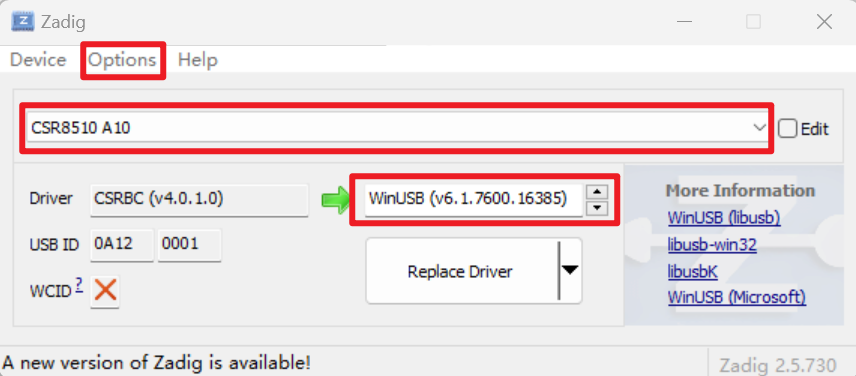
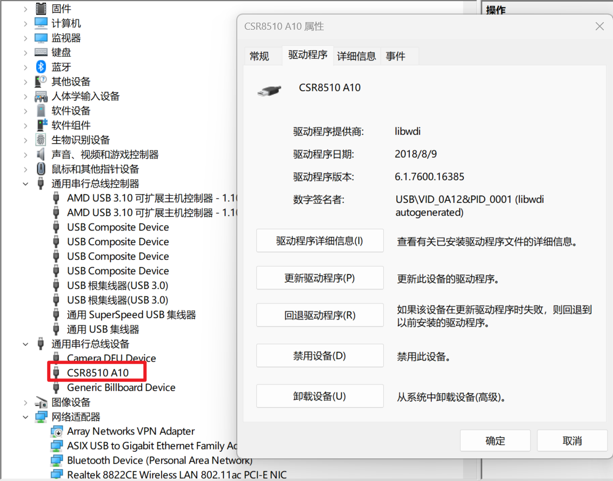

# Bluetooth Tool

## 介绍
本项目主要是学习蓝牙协议栈，为了更好的理解蓝牙协议栈，使用python开发的一个蓝牙Host协议栈，仅实现Host部分协议，不涉及controller和RF。
Host运行在PC上，Controller运行在蓝牙芯片中，PC Host通过标准的HCI接口协议控制蓝牙芯片中的controller。
本项目主要使用电脑上自带的 intel 蓝牙芯片，当然也支持其他 UART HCI 控制的蓝牙芯片。

## 功能

- [ ] Transport
  - [ ] UART 
  - [ ] USB
- [ ] LOG
  - [ ] BT SNOOP([BT Snoop File Format (fte.com)](https://fte.com/webhelpii/bpa600/Content/Technical_Information/BT_Snoop_File_Format.htm))
  - [ ] PACKETLOGGER([PKLG File - What is a .pklg file and how do I open it? (fileinfo.com)](https://fileinfo.com/extension/pklg))
- [ ] HCI
    - [ ] Command
    - [ ] Event
    - [ ] ACL
    - [ ] SCO
    - [ ] ISO
- [ ] class BT
  - [ ] L2CAP 
  - [ ] SDP(server/client)
  - [ ] RFCOMM(server/client)
  - [ ] AVDTP(sink/source)
  - [ ] AVCTP(target/controller)
  - [ ] A2DP(sink/source)
  - [ ] AVRCP(target/controller)
  - [ ] HFP(Audio Gateway/Headset)
  - [ ] SPP(server/client)
- [ ] BLE
  - [ ] L2CAP
  - [ ] SMP
  - [ ] ATT
  - [ ] GAP
  - [ ] GATT
  - [ ] GATT Service
    - [ ] battery service
    - [ ] heart rate service
    - [ ] device infomation service
    - [ ] ANCS
- [ ] LE Audio
  - [ ] Auracast(sink/source/assistant)
  - [ ] Unicast(gateway/headset)
- [ ] Codec
    - [ ] SBC
    - [ ] AAC
    - [ ] LC3
    - [ ] LC3 plus
    - [ ] LDAC
    - [ ] LHDC


## 安装
```
pip install pybtool
```

## 使用
准备controller，这里使用 CSR Dongle 蓝牙为例：

1. 使用 [Zadig](https://zadig.akeo.ie/) 将驱动 替换为 WinUSB 




2. 运行 btool 

```
btool --help
```

## 开发
```
poetry install
poetry run btool
```

## 发布
```
poetry build
poetry publish (or twine upload dist/* ) 
```